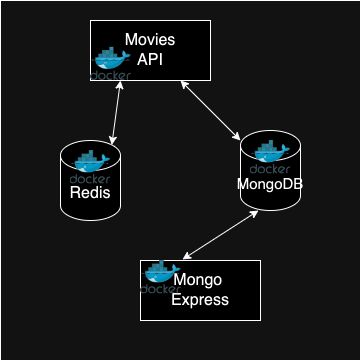

## Docker Assignment - Agile Software Practice

**Name:** Caixian Wang

**Demo:** [https://youtu.be/nl7fQ8273ms](#)

This repository contains the containerization of the multi-container application illustrated below.

### Database Seeding

In the development environment, the application automates the seeding of its database using a `seed.js` script. Upon starting the MongoDB container, the script connects to the MongoDB instance and initializes the database named "movies." It first clears any existing documents in the `movies` collection and then inserts seed data from a JSON file (`seeding.json`). This ensures that the application has a predefined set of movie data available for development purposes.

In the production environment, the MongoDB container will not perform seeding to maintain data stability and integrity.

### Multi-Stack Support

This project supports building both development and production stack options through the use of Docker Compose files. The development environment uses the `docker-compose.dev.yml` file, which includes the API, MongoDB, Mongo Express, and Redis services, along with database seeding. The production environment uses the `docker-compose.prod.yml` file, which only includes the API and MongoDB services, excluding Mongo Express and seeding. This approach allows for flexible configuration of different services according to the needs of each environment.

### Usage Instructions

- **Development Environment**: Run `docker-compose -f docker-compose.dev.yml up` to start all services with seed data.
- **Production Environment**: Run `docker-compose -f docker-compose.prod.yml up` to start the API and MongoDB services without seeding and Mongo Express.
